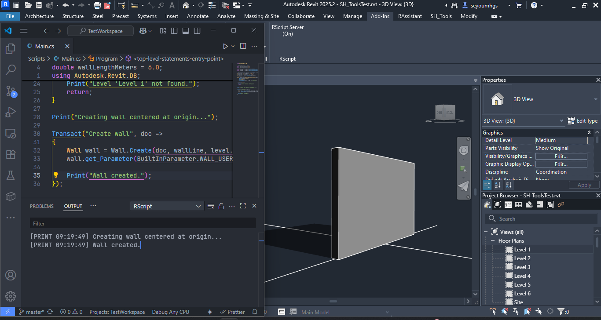

<p align="center">
  
</p>

---

# 🏗️ RScripting

**Streamlined C# scripting for Revit — built on Roslyn, the Revit API, and VS Code**

RScripting (short for Revit Scripting) is a minimal developer environment for writing and running Revit automation scripts — directly from **VS Code**.  
It executes top-level C# scripts instantly inside Revit using Roslyn — no builds, no packaging, no Visual Studio required.

At its core is `RScript`, the native Revit add-in that acts as the runtime engine. In Revit, it appears as a toggle button labeled **"RScriptServer"**, controlling the script execution server.  
Scripts are written in plain `.cs` files using standard C# syntax and powered by the Revit API. To simplify access, RScripting injects a few global variables such as `Doc`, `UIApp`, and `Transact`, making it fast to prototype without boilerplate.

The engine works with:

- `rscript-bridge` — a lightweight .NET console tool that forwards scripts from VS Code to Revit  
- `rscript-extension` — a VS Code extension that scaffolds a scripting workspace with IntelliSense, diagnostics, and command palette integration

Together, these form the RScripting stack — a fast, readable, and build-free automation pipeline for developers working with Revit.

---

## 🚀 Highlights

- ⚡ **Instant execution** via Roslyn scripting  
- 🧠 **Full IntelliSense** + Revit API access (through VS Code)  
- 🔄 **Live feedback** in VS Code's output panel  
- 🔧 **Minimal setup** — no DLL clutter or builds  
- 📂 **Portable `.cs` workspace** — easy to version & share  
- 🖥️ **Lightweight in-Revit toggle** — no embedded UI, just `RScriptServer` control

---

## ⚙️ Getting Started

> **Close both Revit and VS Code before installation**

### 1️⃣ Clone & Build

Use Git Bash (comes with [Git for Windows](https://git-scm.com)):

```bash
git clone https://github.com/Sey56/RScripting.git
cd RScripting
./build.sh
```

Sets up:
- ✅ Revit Add-In
- ✅ IPC Bridge
- ✅ VS Code Extension

---

### 2️⃣ Create Your Scripting Workspace

Create a folder anywhere with any name:

```bash
mkdir TestWorkspace
cd TestWorkspace
code .
```

---

### 3️⃣ Initialize Workspace in VS Code

Run:

```
Ctrl + Shift + P → RScript: Initialize Workspace
```

Click **Restore** in the toaster notification.

Adds:
- `Scripts/` folder with starter scripts
- IntelliSense stubs (`Doc`, `UIDoc`, `UIApp`, `Print`, `Transact`)
- Preconfigured `.csproj`
- `.vscode/tasks.json` for automation

---

### 4️⃣ Launch Revit & Start the Server

- Open your Revit project  
- Go to **Add-Ins → RScript Server**  
- Toggle the server ON

---

### 5️⃣ Send Script to Revit

Back in VS Code, run:

```
Ctrl + Shift + P → RScript: Send To Revit
```

Or press:

```
Ctrl + Alt + R
```

---

### ✅ See Results

- **VS Code Output Tab** → Channel: `RScript`  
  ```
  [PRINT 14:30:05] Creating wall centered at origin...
  [PRINT 14:30:05] Wall created.
  ```

  
**Figure**: Wall placed along the X-axis at the origin, with crossing grids for spatial reference.

- **Local Logs** for diagnostics in local user's home directory:
  - `CodeEditorError.txt`
  - `RScriptBridgeLog.txt`
  - `CodeRunnerDebug.txt`

---

## 🛠️ Build Options

RScripting uses a single, streamlined build method:

### 🐧 Build with Git Bash (Required)

```bash
./build.sh
```

- Runs in **Git Bash** (comes with [Git for Windows](https://git-scm.com))  
- Installs:
  - ✅ Revit Add-In  
  - ✅ IPC Bridge  
  - ✅ VS Code Extension  
- Fast and reliable — no need for Visual Studio or manual copying

---

### 👨‍💻 Development Mode (Preserve bin & obj)

```bash
./build.sh --dev
```

- Keeps `bin` and `obj` folders after build (useful for debugging in Visual Studio)  
- Skips cleanup step to support incremental development  
- Ideal for contributors maintaining RScripting locally

> 💡 `build.sh` must be run in Git Bash. Other terminals like Command Prompt or PowerShell are not supported.

---

## 💻 Requirements

| Component             | Version      |
|----------------------|--------------|
| Windows              | 10 or 11     |
| Revit                | 2025         |
| .NET SDK             | 8.0+         |
| Node.js + npm        | Latest LTS   |
| Visual Studio Code   | Latest       |
| Git + Git Bash       | Required     |

---

## 📘 Tutorials

- [Getting Started →](docs/getting-started.md)  
- [Hello Revit →](docs/hello-revit.md)

---

## 📄 License

MIT — free for personal and commercial use

---

## 👤 Author

**Seyoum Hagos** — Architect · Developer · Workflow Designer  
_Built in collaboration with Copilot and DeepSeek_
