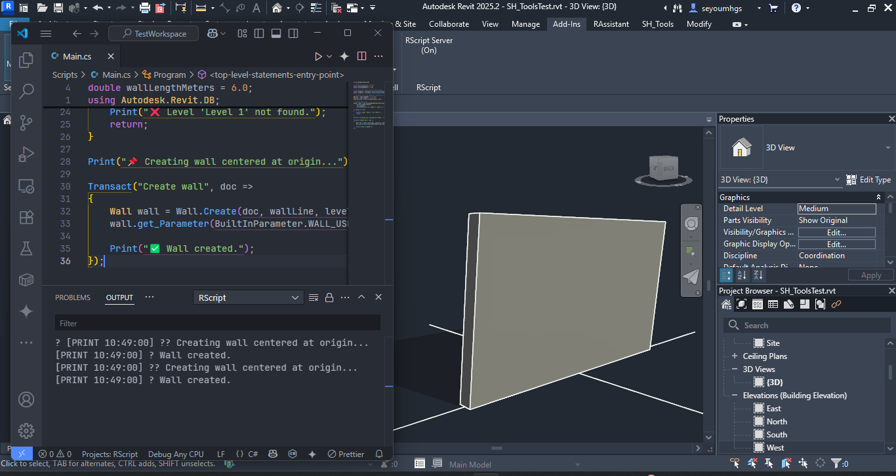

# 🏗️ RScripting

**Lightning-fast C# scripting for Revit 2025 — powered by Roslyn and VS Code**

RScripting (short for Revit Scripting) streamlines Revit automation with live, top-level C# scripting — executed instantly from VS Code, no builds required.  
It complements traditional add-ins and tools like Dynamo by offering a lightweight platform for prototyping, testing ideas, or running production-level scripts — all without packaging overhead.

---

## 🚀 Highlights

- ⚡ **Instant execution** via Roslyn scripting  
- 🧠 **Full IntelliSense** + Revit API access  
- 🔄 **Live feedback** in VS Code's output panel  
- 🔧 **Minimal setup** — no DLL clutter or builds  
- 📂 **Portable `.cs` workspace** — easy to version & share  
- 🧩 **Seamless integration** with Revit UI

---

## ⚙️ Getting Started

> **Close both Revit and VS Code before installation**

### 1️⃣ Clone & Build

Use Git Bash (comes with [Git for Windows](https://git-scm.com)):

```bash
git clone https://github.com/your-username/RScripting.git
cd RScripting
./build.sh
```

Sets up:
- ✅ Revit Add-In
- ✅ IPC Bridge
- ✅ VS Code Extension

---

### 2️⃣ Create Your Scripting Workspace

Create a folder anywhere with any name:

```bash
mkdir SpiralBuilding
cd SpiralBuilding
code .
```

---

### 3️⃣ Initialize Workspace in VS Code

Run:

```
Ctrl + Shift + P → RScript: Initialize Workspace
```

Click **Restore** in the toaster notification.

Adds:
- `Scripts/` folder with starter scripts
- IntelliSense stubs (`Doc`, `UIDoc`, `UIApp`, `Print`, `Transact`)
- Preconfigured `.csproj`
- `.vscode/tasks.json` for automation

---

### 4️⃣ Launch Revit & Start the Server

- Open your Revit project  
- Go to **Add-Ins → RScript Server**  
- Toggle the server ON

---

### 5️⃣ Send Script to Revit

Back in VS Code, run:

```
Ctrl + Shift + P → RScript: Send To Revit
```

Or press:

```
Ctrl + Alt + R
```

---

### ✅ See Results

- **VS Code Output Tab** → Channel: `RScript`  
  ```
  [PRINT 14:30:05] 📌 Creating wall centered at origin...
  [PRINT 14:30:05] ✅ Wall created.
  ```

  
**Figure**: Wall placed along the X-axis at the origin, with crossing grids for spatial reference.

- **Local Logs** for diagnostics in local user's home directory:
  - `CodeEditorError.txt`
  - `RScriptBridgeLog.txt`
  - `CodeRunnerDebug.txt`

---

## 🛠️ Build Options

RScripting uses a single, streamlined build method:

### 🐧 Build with Git Bash (Required)

```bash
./build.sh
```

- Runs in **Git Bash** (comes with [Git for Windows](https://git-scm.com))  
- Installs:
  - ✅ Revit Add-In
  - ✅ IPC Bridge
  - ✅ VS Code Extension  
- Fast and reliable — no need for Visual Studio or manual copying

> 💡 `build.sh` must be run in Git Bash. Other terminals like Command Prompt or PowerShell are not supported.

---

## 💻 Requirements

| Component             | Version      |
|----------------------|--------------|
| Windows              | 10 or 11     |
| Revit                | 2025         |
| .NET SDK             | 8.0+         |
| Node.js + npm        | Latest LTS   |
| Visual Studio Code   | Latest       |
| Git + Git Bash       | Required     |

---

## 📘 Tutorials

- [Getting Started →](docs/getting-started.md)  
- [Hello Revit →](docs/hello-revit.md)

---

## 📄 License

MIT — free for personal and commercial use

---

## 👤 Author

**Seyoum Hagos** — Architect · Developer · Workflow Designer  
_Built in collaboration with Copilot and DeepSeek_